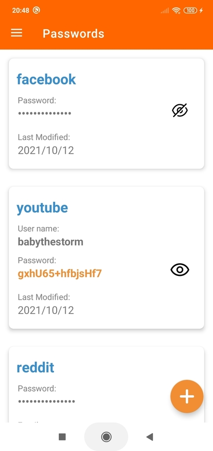
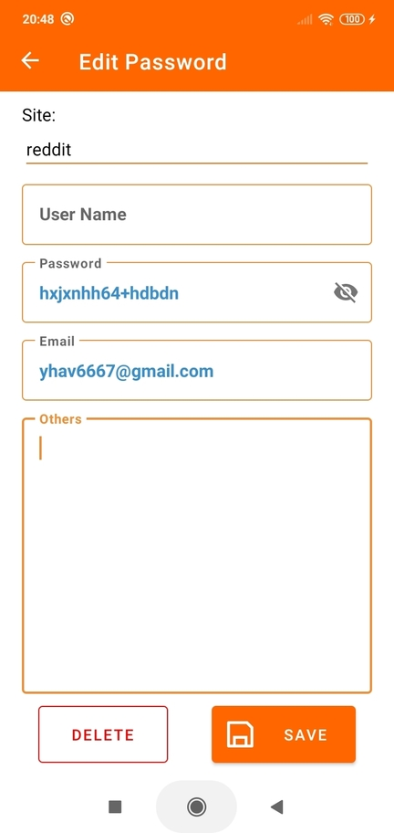

# Pretty Passwords
**100% Secure**: All information is encrypted and stored locally in your device.

**100% Persistent**: User can export the encrypted file from app to transfer between devices.

The data is never put into some database you don't know where in the internet.

### Demo

|Decrypt your passwords|Update as needed|
|:---:|:---:|
|||

### To steal your password, one must:
1. Physically obtain a copy of your encrypted save file
  and
2. Break libsodium or somehow know your master password and tag passwords

### Android concepts used
- [x] Navigation Component
- [x] ViewModel + LiveData
- [x] Activity Result Launcher
- [x] SharedPreferences
- [x] Internal file storage
- [x] File import and export
- [x] RecyclerView with adapter
- [x] Custom Pop Up
- [x] BroadcastReceiver
- [x] SideNav Drawer
- [x] Fragments
- [x] Web View

### Issues/Challenges

#### Version 2 With Android Architecture Comopnents
1. Disappointed at NavigationUI not able to pass in custom argument. There is a use case that both button in the navigation drawer go to the same fragment, the only different is the url argument. [It doesn't support something simple as that](https://stackoverflow.com/a/54684557/5777189)

2. If drawer layout is set up with navController inside a fragment, the drawer layout does not automatically close when clicking the system back button.
Since it is difficult to intercept the back event on child fragment, forcing drawer layout only usable in Activity.
See [Navigation drawer doesn't close when setupWithNavController](https://stackoverflow.com/questions/69513107/navigation-drawer-doesnt-close-when-setupwithnavcontroller)

#### Version 1
 1. If all information are encrypted and stored as a single file in disk, how do you update only a part of the content. (Etc If a user wants to edit one password, only the tag that contains the password needs update, all other tags remain unchanged).
**Resolution:** Break each tag and entry into its own model with reference to each other, when update occur, construct the content from each model and create a new file.

2. [Serializable](https://stackoverflow.com/questions/44698863/bundle-putserializable-serializing-reference-not-value) and [parcelable](https://stackoverflow.com/questions/37694110/when-a-parcelable-object-is-passed-through-an-intent-does-it-update-with-refere) objects do not reference the original object before passing into the activity. Instead they create a new object with the same content. Thus the password entry getting modified and the password entry getting saved into the disk are not the same object.
**Resolution:** Instead of passing in the object into the activity, pass in the index of the object, and retrieve the object from new activity.

3. List of tags and entries need to update automatically as user add or delete new item.
**Resolution:** Use a BroadcastReceiver to listen for such events and update the data list inside the RecyclerView's adapter

4. On softkeyboard hide and show, adjustResize and adjustPan both cause recyclverView to automatically updated its element on the UI without specifically calling notifyDataSetChanged.

